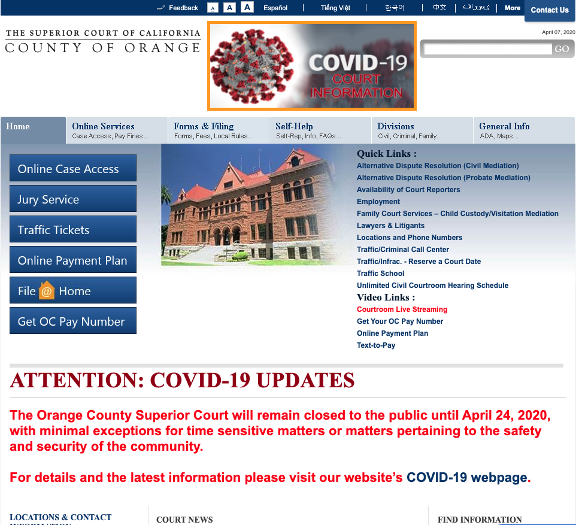
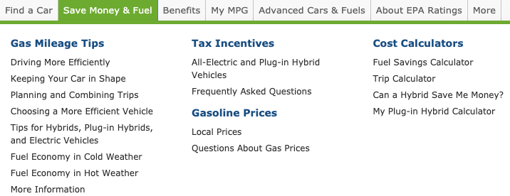
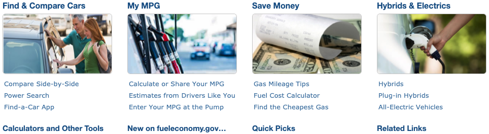
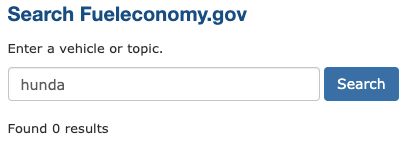

# UX for Public Awareness 
## DH150 Assignment 01: Heuristic Evaluation by Amy Pham 

Governmental departments and public service organizations are created to help everyday communities by providing municipial services, information, and resources. However, the public sector is difficult to navigate due to lack of accessibility, language barriers, educational differences, and so forth. Because of this, many groups utilize websites as a platform to communicate with their constituents and to provide further assistance. The first website is for Fuel Economy, which is a federal government website dedicated to help consumers make better informed fuel economy choices. The second website is for the County of Orange's Superior Court, serving the community by administering justice and resolving disputes related to various types of law. Through the improvement of the UX design for these websites, I can help everyday citizens better navigate the public sector system in order to find the help they deserve. 

## Website 1: Fuel Economy 
Link: https://fueleconomy.gov/
The Fuel Economy website has a plethora of information and reources. However, when entering the website for the first time, the home page seems to be overwhelmed with links and a lot of text. Here are a few of the main UX issues that could be improved for the website: overwhelming amount of text, unclear titles, unclear purposes for website features, and and so forth. 

## Website 2: The Superior Court of California: County of Orange 
Link: https://www.occourts.org/
The Superior Court of California: County of Orange website has many features, such as self-help, forms and filing, jury services, etc. The main home page of the website seems to be overwhelmed with information with multiple items being bolded or marked in a different color to be more important, but there's multiple items that are marked in this manner, which is confusing. Here are a few of the main UX issues that could be improved for the website: overwhelming amount of text, consistency, pixelated text (difficult on the eyes), etc. 

  

## Heuristic Evaluation: Severity Scale 
1: Aesthetic/Cosmetic Problem - may be fixed, if times and circumstances allow

2: Minor Usability Problem - should be fixed 

3: Major Usability Problem - top priority, must be fixed

## Heuristic Evaluation - Website 1: Fuel Economy 
### 1. Visibility of System Status 
The visibility of system status keeps the users informed about what is going on with the website. 

• Rating (3): When hovering over the navigation bar, the links turn to a different color of gray, but it is not easily visible. By making it more visible, users will know that they are interacting with the page. 

 

### 2. Match Between Systems and The Real World 
The system should refect real world conventions, matching the digital space to the physical space. 

• The website includes images and icons that reflect the real world. This is helpful to users if they are not familar with specific terms, but are able to recognize the images or icons. 
IMAGE 

 

### 3. User Control and Freedom 
This allows users to easily exit or back out of an action on the website without extra trouble. 

• When searching for types of cars through various filters, users can easily clear the entire selection if a mistake has been made. 

### 4. Consistency and Standards 
Specific words, actions, and symbols should mean the same thing. 

• Rating (2): Throughout the website, fuel, gas, and electricity are used interchangeably. However, most people refer to the gas in their car as just gas, not fuel. The changes in vocabulary can be difficult for the lay person and it should be more defined throughout the website. 

 

• Rating (2): Additionally, half of the blue title links on the home page are links while the other half are static. These should not look the same because a user may go to click these titles, but nothing happens for the static ones. This may be confusing for the user as they are expecting it to be a link. 

 

### 5. Error Prevention 
Design prevents prevents problems from occurring. 

• Rating (2): When typing an entry into the search bar, if the entry is not the exact spelling or phrase found on the website, the website will just return 0 results and does not provide any help to avoid such errors. The website can help reduce these errors by providing common search terms, autocorrect, and so forth. 

 

### 6. Recognition Rather Than Recall 
By making options, actions, and objects more visible, the system is easing the user's memory load. 

• Rating (2): For many of the pages, there is a navigation bar on the right side of the page that tells the users what content is in the section, allowing them to easily navigate towards specific topics; however, this sidebar of content does not move with the user as they scroll, forcing the user to scroll up to navigate to a different section and try to remember all the sections of the page. 

 

• Rating (2): The main header with navigation links is not visible when users scroll down the page. This forces the users to continuously scroll up if they are specifically looking for a new page. 

### 7. Flexibility and Efficiency of Use 
This allows users to tailor frequent actions or to accelerate the interaction with the website. 

• The Power Search option of the website allows more advanced users to narrow down the search options. Additionally, since it allows users to choose as many or as few features, more beginner users can put in the information that they only know and still get results. This allows more advanced users to more efficiently use the site, but still user-friendly enough to allow new users utilize the search option. 

### 8. Aesthetic and Minimalist Design 
Design should only include necessary and relevant information. 

• Rating (3): There is a large amount of links on the home page. This list should be minimized to highlight the most relevant resources or services that the website offers, so that users are not overwhelmed with information. 

### 9. Help Users Recognize, Diagnose, and Recover from Errors
The website's error messages should be in plain language, understandable, and with steps to further take. 

• Rating (2): When random text is included in the URL, there is a 404 Not Found error page. The error page does well in the fact that it states possible reason why the page is wrong, but it does not indicate further steps to take. We could suggest for users to return to the home page or redirect them to a help page. 
IMAGE 

### 10. Help and Documentation
Help and documentation may be necessary to help the user navigate the system. 

• Rating (3): The FAQ of the website does not allow the user to specifically ask questions or to narrow down the question search. There are only prewritten questions and no option to further explore for help. 

## Heuristic Evaluation - Website 2: The Superior Court of California: County of Orange 
### 1. Visibility of System Status 
The visibility of system status keeps the users informed about what is going on with the website. 

• When hovering over links, there is a change within the text, such as highlighting or underlining. This allows the users to know that they are successfully interaction with the system. However, these changes with the links are not consistent as some links are being highlighted while others are not. This issue is mentioned in 4. Consistency and Standards. 

### 2. Match Between Systems and The Real World 
The system should refect real world conventions, matching the digital space to the physical space. 

• Rating (2): The addition of icons would be helpful to navigate the website as there is so much text and very little imagery. These icons could help users recognize various topics. 
IMAGE 

### 3. User Control and Freedom 
This allows users to easily exit or back out of an action on the website without extra trouble. 

• Rating (2): When opening up a tab on the website, you cannot reclose the tab unless you click on another tab. This does not allow the user to freely open and close options. This may be frustrating as the information on these tabs take up a lot of space on the website and makes it difficult to scroll and look for other information with so much text in the way, yet it is unable to close. 

### 4. Consistency and Standards 
Specific words, actions, and symbols should mean the same thing. 

• Rating (3): When hovering over links, there is an unconsistent visibility status shown. For some links, the text will be highlighted when hovered while in other cases, the links are underlined. This could be confusing for users when two different actions are shown; to make this better, there should be one consistent styling for hovering over links. 

IMAGE

### 5. Error Prevention 
Design prevents prevents problems from occurring. 

• Rating (2): When typing an entry into the search bar, if the entry is not the exact spelling or phrase found on the website, the website will just return "No Results" and does not provide any help to avoid such errors. The website can help reduce these errors by providing common search terms, autocorrect, and so forth. 
IMAGE 

### 6. Recognition Rather Than Recall
By making options, actions, and objects more visible, the system is easing the user's memory load. 

• Regardless of what page the user clicks, the website shows the flow pages the user has been on. This allows the user to easily go back one page, two pages, the home page, or whichever else page. This allows the user to easily exit to a specific page without needing to remember which page it was as the past options show up on the screen. 

IMAGE 

### 7. Flexibility and Efficiency of Use 
This allows users to tailor frequent actions or to accelerate the interaction with the website. 

• Those who are familiar with the site and know all their information can easily just input the case number and quickly find their information. This allows them to use less time to narrow down their search. There is an option for more beginner users who don't know all their information to filter and find their case. 

IMAGE

### 8. Aesthetic and Minimalist Design 
Design should only include necessary and relevant information. 

• Rating (3): The website has an overwhelming amount of text in various colors, fonts, and design. It makes the entire website very distracting and difficult to track down the most relevant information to the user. 
IMAGE
• Rating (1): The website has pixelated titles, making it difficult to read the information. 
IMAGE 

### 9. Help Users Recognize, Diagnose, and Recover from Errors
The website's error messages should be in plain language, understandable, and with steps to further take. 

• Rating (3): When random text is included in the URL, there is a 404 Not Found error page. The error page does well in the fact that it states possible reason why the page is wrong, but it does not indicate further steps to take. We could suggest for users to return to the home page or redirect them to a help page. 
IMAGE 

### 10. Help and Documentation
Help and documentation may be necessary to help the user navigate the system. 

• Rating (1): On the home page, there is not a general FAQ page. Within specific sections, there are FAQ section, but you would have to find these sections first. To help users navigate the system, there should be a general FAQ page. 
