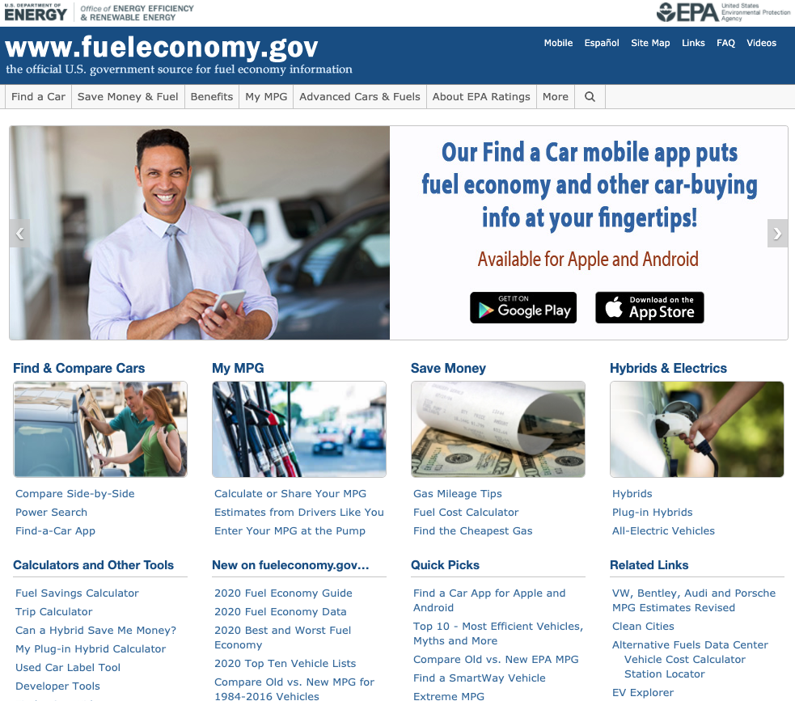

# UX for Public Awareness 
## DH150 Assignment 01: Heuristic Evaluation by Amy Pham 

Although governmental departments and public service organizations are created to serve everyday communities, these systems may be difficult to navigate due to lack of accessibility, language barriers, educational differences, and so forth. 

## Website 1: Fuel Economy 
Link: https://fueleconomy.gov/

## Website 2: The Superior Court of California: County of Orange 
Link: https://www.occourts.org/

## Heuristic Evaluation: Severity Scale 
1: 
2: 
3: 

## Heuristic Evaluation - Website 1: Fuel Economy 
## 1. Visibility 

## Heuristic Evaluation - Website 2: The Superior Court of California: County of Orange 

